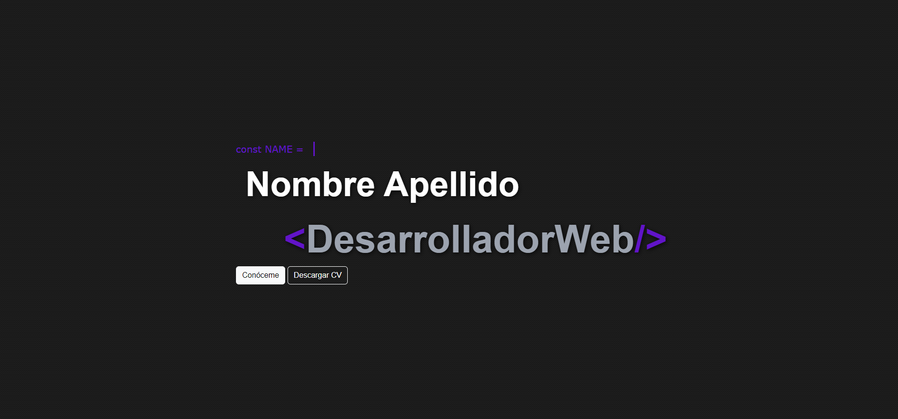

# Página Web - 1 - Página Web en HTML, CSS y JavaScript.

Realiza una página web para uso personal.

> Si tienes alguna pregunta o problema, no dudes en ponerte en contacto conmigo a través de mi correo electrónico: esguvioficial@gmail.com .

Recursos utilizados:

-   [Visual Studio Code Windows .exe](https://code.visualstudio.com/)
-   [XAMPP última version (opcional para futuras actualizaciones)](https://www.apachefriends.org/es/download.html)
